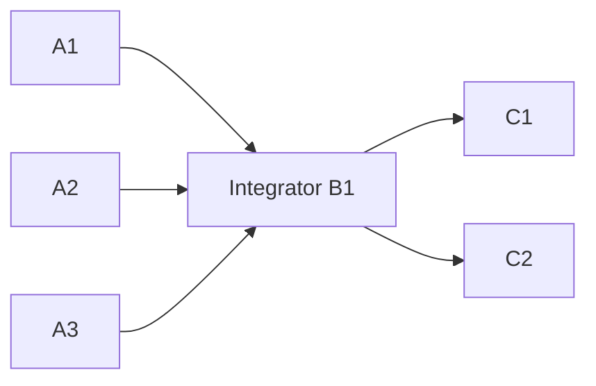

# Shared program execution

## Decision and assessment

The 2026-09-07 Claude conversation proposed a thin program executor: shared
files, prompt-level territories, a sole integrator after parallel work, and a
result when the graph ends. The local Claude Stage B script corroborates that
pattern: writers report cross-territory requests, then one integration agent
applies them and runs repository gates. This is evidence of the authoring
pattern, not a guarantee about every Claude run or provider.

The implementation at `5172e09` did not meet that direction:

| Boundary | Before | New goal launches |
| --- | --- | --- |
| Workspace | Isolation enabled unless setup explicitly disabled it | Shared target directory; `--isolation` is explicit |
| File scope | Every changed file had to be declared or the action failed | Advisory territory; no default manifest, copying, integration, or rollback |
| Shared concurrency | At most one writer | Disjoint territories run concurrently; overlapping writers serialize |
| Dependency execution | Awaited the entire selected batch | Starts a dependent as soon as its own inputs finish |
| Integrator | Required an exhaustive file list | Shared build/chore action with empty `ownedFiles` runs alone and may fix any file |
| Graph validation | Rejected ordering without an artifact or overlapping file | Accepts ordinary acyclic dependencies; validates declared artifact references |
| Completion | Required fresh passing evidence and opened gap rounds | Returns all action results when the graph ends |
| Verification | `completed` implied `verified` | `verified` separately reports passing mandatory requirement evidence |
| Unexpected action error | Could terminate the kernel | Records a failed action, retains shared edits, and continues independent branches |
| Quiet agent | Heartbeat depended on provider output | Independent 10-second kernel heartbeat |

## Execution contract



The caller authors the graph using `workflow plan contract` and launches with
`workflow goal --program`. `--orchestrator` remains an explicit alternative
that delegates planning. Routing, quota exclusion, recursion depth, content
judgment, and mechanical retries still use the existing dispatcher.

Workers receive territory guidance, dependency output paths, and instructions
to preserve user and sibling edits. The recommended integrator reads those
outputs, applies requests for shared files, and runs the actual repository
acceptance commands. An unrestricted integrator runs alone, including readers.
The kernel never invents an integration task or acceptance command.

An action failure skips its success-dependent descendants; independent work
continues. The terminal status is `completed`, `partial`, or `cancelled`.
Negative requirement evidence is returned unchanged and does not trigger a
planner round. Initial scouting and explicit user steering can still create a
durable caller-planner pause. Steering waits for active workers before changing
the program. Further repairs after a terminal result use a new program.

`result.json` includes every action's status, failure, and output artifact, plus
requirement evidence and `verified`. Workspace files remain in the target tree.
The optional Git inventory lists current changed paths, the initial dirty-path
list, and warnings. It includes pre-existing and concurrent changes; it is not
per-worker attribution. Failure to obtain that inventory never fails the work.

## Compatibility

New CLI launches persist `config.settings.executionMode = "program"` and
`workspaceMode = "shared"`. Saved V2 documents without `executionMode` retain
their original requirement-gated completion, planner boundaries, and workspace
policy. Resume does not reinterpret historical work under the new contract.
Fixed authored graphs and their explicit `verify` steps retain their existing
semantics.

`--isolation` preserves strict per-worker worktrees. Isolated writers must
declare exact files; unrestricted writers are refused before dispatch. This
opt-in path can still reject out-of-scope edits. The default shared path never
discards work for that reason.

## Evidence and limits

`tests/workflow-program.test.js` exercises shared-file retention, new files,
overlap serialization, unrestricted integration, dependency-ready execution,
failure propagation, optional/negative evidence, failed scouting, heartbeat,
cancellation, resume, steering, literal filenames, unavailable Git inventory,
and explicit isolation. Its real CLI fixture runs six routed local child
processes in the graph above, proves a peak of three writers, checks recursion
depth, and inspects the resulting files and all six durable outputs. The
detached CLI test separately proves that negative evidence produces a stable
result without another planner round. Legacy CLI recovery tests use saved
requests without the new mode.

Validation commands:

```bash
npm test
node --test --test-timeout=30000 tests/workflow-program.test.js
```

The initial implementation passed **605/605** tests, including 17 program
regressions; the untouched baseline passed 588/588. Release hardening adds the
process-boundary recovery and dependency-display regressions described below.

These are deterministic local tests, including real subprocess dispatch; they
do not call paid model providers or prove model-generated work quality.
Territories are coordination guidance, not a security sandbox. A kernel or
machine can still stop; recovery skips durable successes and replays unfinished
actions, so external side effects are not exactly-once. Provider failures and
bad plans remain possible. The simplification removes unnecessary engine
failure paths rather than promising infallibility.


## Live provider acceptance (2026-09-08)

Run `ggtegs` (`wf-mts0h1pp-1228a7`) used the installed CLI in a disposable
calculator repository. Its exact six-action graph completed in 4m10s:

- Three Grok 4.6 builders overlapped in one shared tree and each added a focused
  test file outside its advisory source-file territory.
- One Grok integrator started after all builders finished, combined their
  modules, wrote usage documentation, and passed the 13-test suite.
- Two Claude Sonnet 5 reviewers overlapped after integration and returned
  passing evidence. There were six attempts, one submitted program, no planner
  dispatches, and no additional planning pause.
- Local inspection confirmed the files, preserved user note, and passing tests.
  Durable action timestamps confirmed the concurrency and dependency order.

The result reported `completed` and `verified: true`, but independent caller
probes found an implementation bug missed by both reviewers: inherited operation
names such as `constructor`, `toString`, and `valueOf` threw TypeError instead of
RangeError. This is a model-output limitation, not evidence that the workflow
kernel failed. Passing evidence verdicts are not a correctness guarantee.
The explicit repair run `nx5dyi` (`wf-mts0mwt1-4b4a74`) completed with passing
independent evidence. Its regression first reproduced the failure, then the
repair passed all 18 tests. Caller probes also confirmed inherited names,
coerced arrays/objects, symbols, null, and undefined now throw RangeError.
Resuming the original completed run returned its existing result with exactly
six attempts and no worker replay.


## Fresh-controller acceptance

These controllers started in new sessions, read the installed skill, and
received one short, human-style task prompt. No coordinator corrections were
sent while they worked. Pool selection remained automatic; the controller's
model and the dispatched worker models are separate choices.

| Controller | Task and graph | Durable result |
| --- | --- | --- |
| Fresh Claude | Transaction CSV report CLI: three writers → sole integrator → two independent reviewers | `ue5gbs`, 6 attempts, 1 program, 18m17s, completed with passing evidence |
| Fresh Grok 4.6 | Non-repository Temporal/Restate/Inngest research: three researchers → synthesis → independent source check | `efy8c2`, 5 attempts, 1 program, 23m06s, completed with passing evidence |
| Fresh Codex `gpt-5.6-sol`, medium | Existing repository, read-only cancellation/recovery audit: two parallel auditors → independent verifier | `mkvn9a`, 3 attempts, 1 program, 24m49s, completed with passing evidence |

The Claude controller recovered from one rejected plan: a verifier prompt
comparing documented product JSON/output was incorrectly treated as an attempt
to replace the kernel's evidence format. The release narrows that check; the
exact rejected plan now validates, while explicit verdict-format overrides are
still rejected. After its workflow, the controller used one bounded delegate
to address reviewer concerns (test strength and README wording). It finished
with 89/89 tests and reported 115 independent CLI probes with no failures.
The coordinator separately ran the original 85 tests and nine adversarial CLI
scenarios, then re-ran all 89 tests after the follow-up; all five protected seed files were byte-identical. The caller also
verified that a deliberately reintroduced floating-point parsing mutation fails
the strengthened tests. These checks are separate from the passing verdicts.

The Grok controller produced `COMPARISON.md` and three source reports in a
non-Git research directory. The independent verifier inspected all three retry,
recovery, and operational comparisons and checked official source links. Its
report preserves pricing/documentation inconsistencies as uncertainties. The
coordinator spot-checked the official [Temporal](https://docs.temporal.io/develop/typescript/workflows/timeouts),
[Restate](https://docs.restate.dev/develop/ts/error-handling), and
[Inngest](https://www.inngest.com/docs/features/inngest-functions/error-retries/retries)
retry documentation independently. This proves
the non-repository research path, not universal correctness of every research
claim or lasting accuracy of pricing.

The Sol controller kept its existing checkout unchanged at `89cda2c`. The audit
and independent verifier found concrete release blockers despite passing
ordinary unit tests: cancellation could be overwritten, a successful attempt
could replay before its action status was committed, isolated recovery could
delete unfinished work, and V2 lacked reliable process ownership on interruption.
The verifier corrected an overbroad submodule finding: default shared program
mode did not enforce ownership, so that defect affected isolation/legacy modes.
One audit-shell full-suite failure came from its inherited `CLAUDE_CONFIG_DIR`;
the affected test passed with that variable removed.

## Release hardening from the acceptance findings

- A separate cancellation-intent file prevents the operator from rolling back
  kernel state or having a request overwritten. Paused-run and watch readers
  overlay that intent immediately.
- An exclusive kernel lease fences state writes and caller submissions.
  Recorded process identities and process groups let resume drain surviving
  delegates before re-dispatch. SIGTERM/SIGINT now commit a resumable V2
  interruption; watch names the resume command.
- A durable completion receipt precedes the successful attempt snapshot.
  Recovery resumes ownership/evidence/integration processing from either side
  of that write boundary. A partially applied isolated integration tolerates
  already-applied identical files but rejects different user edits.
- Each new isolated attempt gets a separate tree. Unfinished trees survive and
  are named in result warnings. Failed setup cleans its own registration, and
  manifests inspect submodule files without treating a directory as a file.
- Program presentation groups use topological dependency levels. They do not
  impose barriers: a ready dependent can run while an unrelated earlier-level
  action is still active. Saved runs are projected into the corrected view
  without rewriting their state or event history.

`tests/workflow-v2-recovery.test.js` crosses real process boundaries: it kills
kernels after receipt/attempt persistence and during isolated integration,
checks shared and isolated output is applied once, preserves conflicting user
edits, forces the cancellation/persist interleaving, signals real CLI delegates
with child processes, and races two resumes. Existing interrupted attempts may
still have unknown external effects and can run again; this is not an
exactly-once guarantee for arbitrary external services or power loss.

Final release validation on 2026-09-08: **621/621** repository tests passed.
The coordinator re-ran the completed transaction CLI suite (**89/89**) and
rendered both saved research/audit runs through the corrected dependency view.
